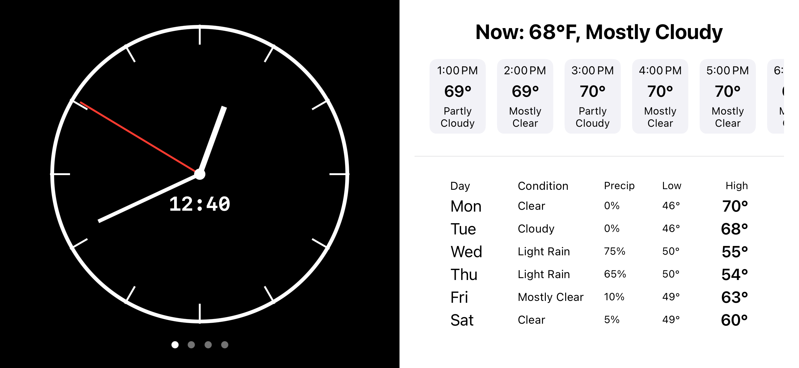

# Personal Dashboard iOS App

A multi-functional iOS dashboard designed for landscape orientation, featuring real-time clock, weather forecasts, countdown timer, and web view. Built with SwiftUI.



## Features

### 1. **Real-Time Clock**
- Analog clock with hour/minute/second hands and hour markers.
- Digital time display below the clock.
- Updates every second with smooth animations.

### 2. **Weather Dashboard**
- **Current Weather**: Temperature and condition (e.g., "Clear", "Rain").
- **Hourly Forecast**: 27-hour scrollable forecast with:
  - Time
  - Temperature
  - Weather condition (e.g., "Partly Cloudy")
- **Daily Forecast**: 7-day outlook with:
  - Day abbreviation (e.g., "MON")
  - High/low temperatures
  - Precipitation probability
  - Condition
- Powered by [Tomorrow.io API](https://tomorrow.io).

### 3. **Countdown Timer**
- Customizable duration picker (hours/minutes/seconds).
- Start/Pause/Cancel controls.
- Full-screen display when active with large monospaced timer.
- Resets to last configured duration on cancel.

### 4. **Web View**
- Embedded browser for `https://apple.com` (configurable in code).

### 5. **Split-Screen Layout**
- Two independent panels (left/right) swipable between:
  - Clock
  - Weather
  - Timer
  - Web View
- Auto-adjusts to prevent duplicate panels.

## Technical Stack
- **SwiftUI** for UI components
- **Combine** for timer updates
- **UIKit Integration** (UIDatePicker for timer)
- **Tomorrow.io API** for weather data
- `URLSession` for networking

## Installation

### Prerequisites
- Xcode 13+
- iOS 15+
- Tomorrow.io API key (free tier available)

### Steps
1. Clone the repository:
   ```bash
   git clone [REPO_URL]
   ```
2. Open `personal.xcodeproj` in Xcode.
3. Replace the Tomorrow.io API key:
  - In `ContentView.swift`, update:
    - ```swift
       private let apiKey = "YOUR_API_KEY" // Replace with your key
      ```
4. (Optional) Modify the default location in `WeatherViewModel` (default: Philadelphia, PA):
   - ```swift
     private let location = "LATITUDE,LONGITUDE"
     ```
5. Build and run on a simulator or device.

## Usage
- **Switch Panels**: Swipe left/right on either half of the screen.
- **Timer**:
  - Set duration using the wheel picker.
  - Tap "Start" to begin countdown.
  - "Pause" stops the timer; "Cancel" resets it.
- **Weather**: Automatically updates on app launch.
- **Screen Always On**: Device won't sleep while app is active.

## Configuration Tips

- **Web View URL**: Modify `WebView(url: URL(string: "https://apple.com")!` in `ContentView.swift`.
- **Weather Units**: Change `units` variable in `WeatherViewModel` to `metric` for Celsius.
- **Orientation**: Locked to landscape mode (see `previewInterfaceOrientation`).

## Limitations & TODOs

- WebView URL is hardcoded.
- Location is fixed (no GPS integration).
- API key is exposed in code (use environment variables for production).
- No error handling for failed API calls.
- Voice control to switch views
- Spotify + Discord integration 

### Small backstory: 
Had my old iPhone 7 laying around, and didn't want it to end up as e-waste. I still find it unsettling that technology can become obsolete so quickly, even though devices like my iPhone 7 can still be used. 
I had always wanted some kind of always-on display, but could never justify the price point. With my app, I can use a device I already have and tailor it to my own preferences! 

## License
MIT License. Free for personal and educational use. Commercial use requires permission from Tomorrow.io for API access.
